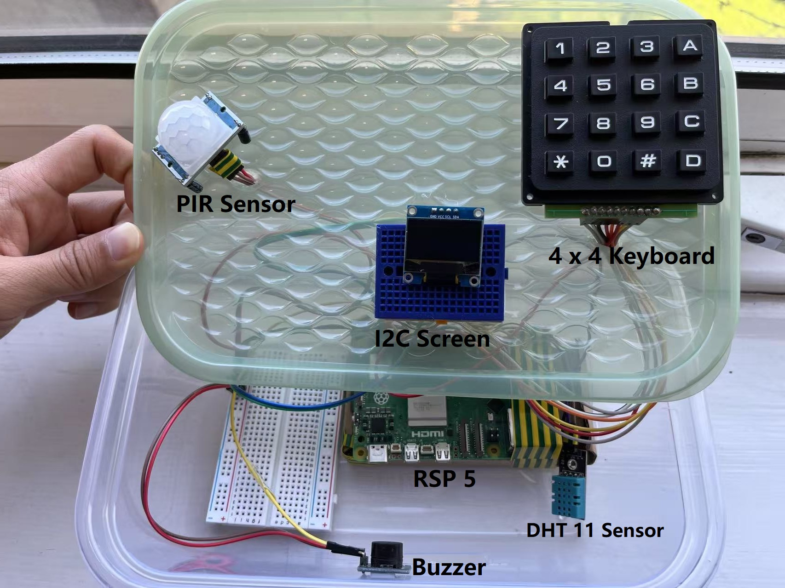
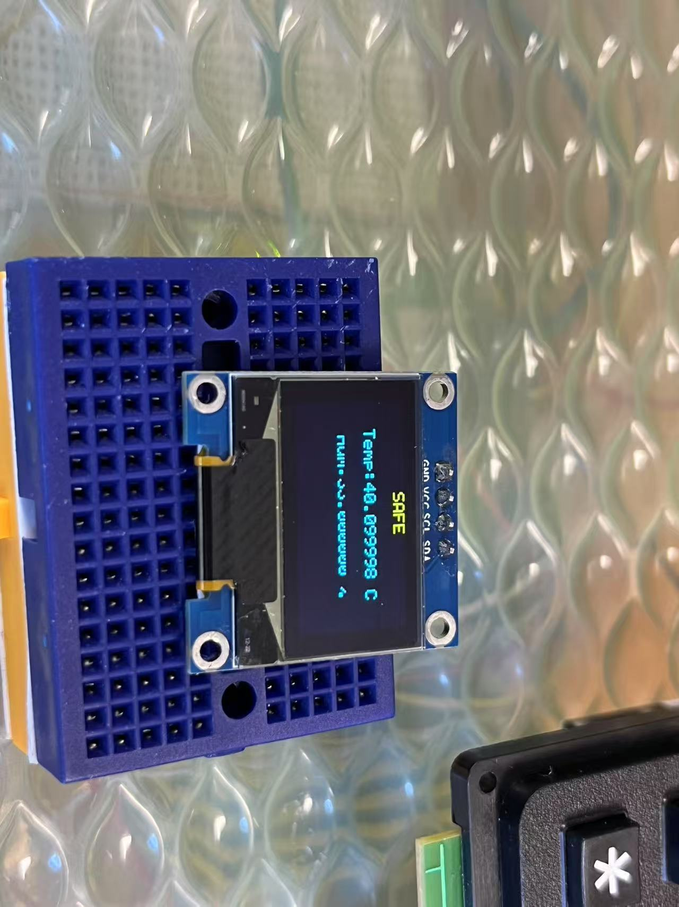
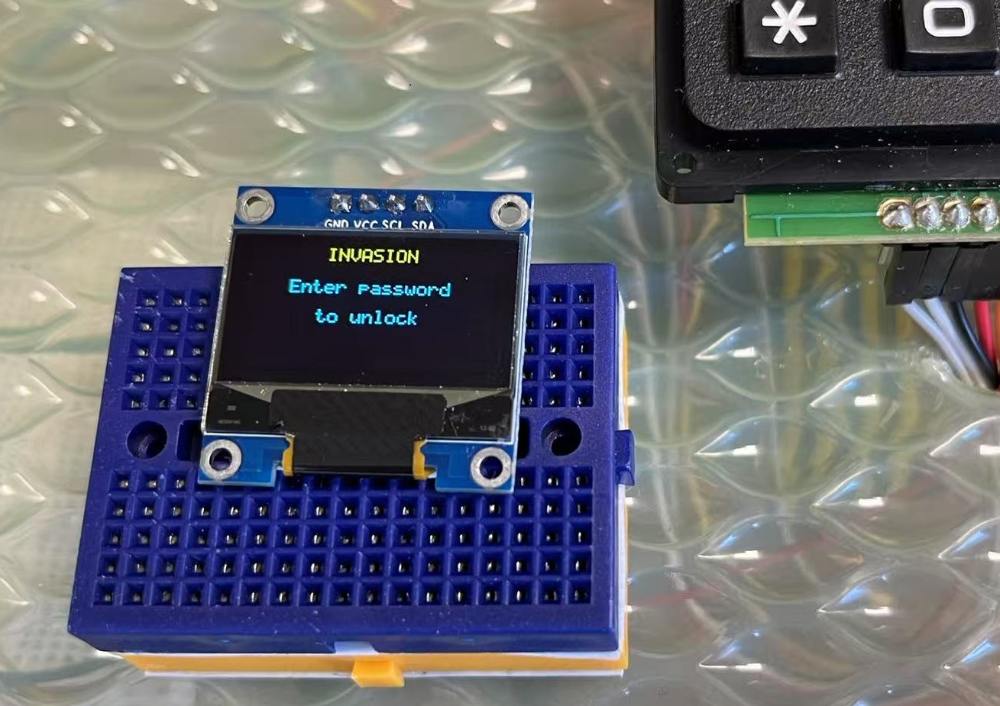
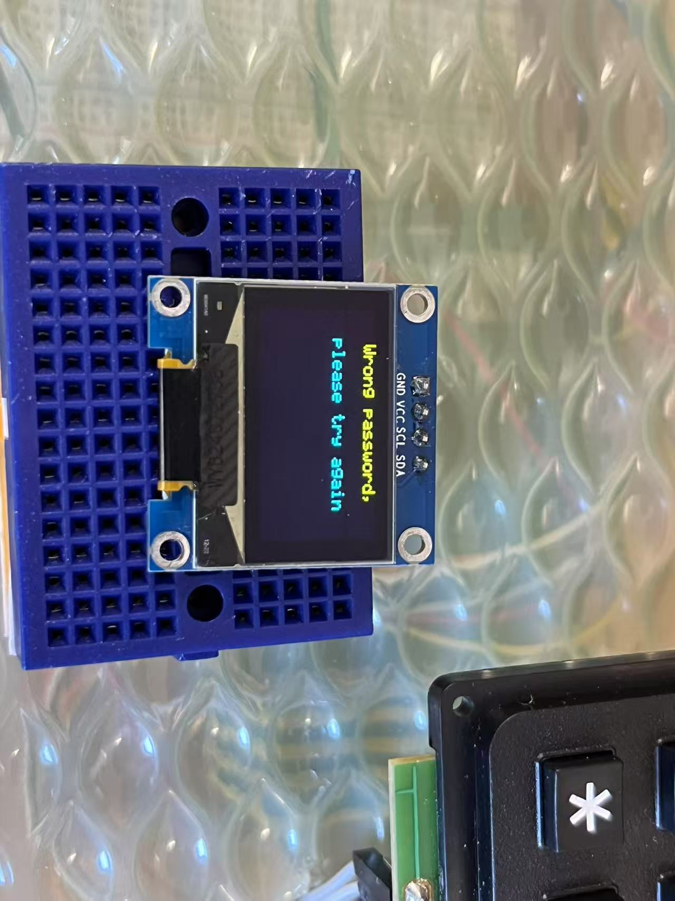

  # Raspberry Pi Home Security System

## 📊 Project Overview
This project implements a **mini home security system** based on a **Raspberry Pi 5**, integrating multiple sensors and communication modules. The system monitors environmental conditions, detects movement, triggers alarms, and allows local and remote control.
- **overall picture of project**
 
- **components of project**
 
---

## 🧠 Features
- **Motion Detection (PIR Sensor):** Triggers an alarm when motion is detected.
- **Buzzer Alarm:** Emits a sound when PIR detects motion.
- **I2C OLED Display:** Shows real-time temperature, humidity, and alarm states.
- **4x4 Matrix Keypad:** Used for entering passwords to deactivate the alarm.
- **Telegram Bot Control:** Provides remote access to:
  - Receive temperature and humidity data
  - Get alarm notifications
  - Remotely deactivate the alarm
- **DHT11 Temperature & Humidity Sensor:** Continuously measures and updates readings every 2 seconds.

---
## Other info
- **branch**:
  - **main**: our release branch, also for code review;
  - **feature/develop**: for merge of different features;
  - **feature/xxx**: individual function develop branch;
  - **feature/test**: for unit test;
  
---
  
## 💻 System Architecture
```
Raspberry Pi 5
|
|-- PIR Sensor (Motion Detection)
|-- Buzzer (PWM-Controlled Alarm)
|-- I2C OLED Display (Real-Time Display)
|-- 4x4 Matrix Keypad (Password Input)
|-- Telegram Bot (Remote Notification & Control)
|-- DHT11 Sensor (Temp & Humidity Monitoring)
```

---

## 📅 System Behavior
- In **normal state**, the OLED displays temperature and humidity.
- If **motion is detected**, the system:
  - Activates the **buzzer alarm**
  - Displays **ALARM** message on OLED
  - Sends an **alarm notification via Telegram**
  - Awaits **correct password input** from keypad or Telegram to disable
- Upon **correct password input**:
  - The system stops the alarm
  - OLED resumes normal temperature/humidity display

---

## 🛠️ Technical Details
- GPIO controlled via **libgpiod** (not `wiringPi`)
- PWM for buzzer using `/sys/class/pwm/`
- Keypad supports non-blocking multi-key detection
- Telegram Bot API integrated with asynchronous event handling
- All modules (sensors, display, keypad, telegram bot) run in separate **threads with callback logic**

---

## 🔧 Build & Run
### Dependencies:
- `libgpiod`
- `cURL` (for Telegram Bot HTTP requests)
- `C++17` or above

### Build:
```bash
mkdir build && cd build
cmake ..
make
```

### Run:
```bash
sudo ./alarm_system
```

---
## IO Configeration
    - KEY_COL1_IO = 1,
    - KEY_COL2_IO = 7,
    - KEY_COL3_IO = 8,
    - KEY_ROW1_IO = 13,
    - PIR_IO = 14,
    - DHT_IO = 15,
    - KEY_ROW2_IO = 16,
    - VCC_IO = 17,
    - BUZZER_IO = 18,
    - KEY_ROW3_IO = 20,
    - KEY_ROW4_IO = 21,
    - KEY_COL4_IO = 26,
    - GND_IO = 27
---

## 📲 Telegram Bot Setup
1. Create a bot via [BotFather](https://t.me/BotFather)
2. Copy your `BOT_TOKEN`
3. Insert the token into your config or source file
4. Authorize your chat ID for notifications

---

## 🔒 Password Logic
- Default password can be set via configuration file or source code constant
- Keypad or Telegram input is verified against this password
- Incorrect entries will not disable the alarm

---

## Display Logic
- The I2C OLED display in this project is used to visually present system states and sensor data in real time.
- In normal state, the display shows the current temperature and humidity data from the DHT11 sensor. The temperature is displayed as "Temp: XX C", and the humidity as "Hum: XX %".
- In ALARM state, triggered by the PIR sensor, it shows "INVASION" until the correct password is entered via the keypad or Telegram bot.
- If the password is correct, the display returns to normal.If the password is incorrect, it shows "Wrong password, please try again" for 2 seconds, then returns to "INVASION".
- The display operates in a separate thread for real-time updates without affecting system responsiveness.The OLED uses I2C communication, and updates are handled via asynchronous callbacks.
- Characters are displayed using a 5x7 pixel font for clarity.

---

## Keyboard Logic
- The 4x4 matrix keypad is used for password input to deactivate the alarm. The keyboard operates in an event-driven mode to ensure responsiveness.
- The system detect key presses using pseudo block of 10hz rate. When a key is pressed, the row is shorted to a low-level column, pulling the voltage down. This change is detected as a key press event.
- The keyboard scanning process runs in a dedicated thread, allowing continuous monitoring without blocking the main program.
- To debounce and accurately detect key presses, the system sets each column to low level one by one and checks all row states. After a key is detected, the system waits for the key to be released before accepting new inputs, avoiding repeated detections.
- The keyboard input is tightly integrated with the I2cDisplayHandle, enabling real-time feedback on the OLED display.

---

## Buzzer Logic
- Driven by RSP hardware PWM, Freq : 1000hz, DutyCycle : 50%;

---

## 🌡️ DHT Logic
- The DHT sensor uses a single-wire protocol to communicate with the Raspberry Pi. 
- The Pi sends a start signal (low for ~18ms) to initiate data transfer. The DHT then responds with a 40-bit data stream encoding temperature and humidity values. Timing-based bit interpretation is used to decode the signal. 
- In this project, the sensor is read every 2 seconds, and when the system is not in an alarm state, the data is displayed on the I2C screen.

---

## 🕵️ PIR Logic
- The PIR sensor detects changes in infrared radiation (motion) and outputs a digital HIGH signal when motion is detected. This signal is connected to a GPIO input pin on the Raspberry Pi configured for interrupt-based detection. Upon a rising edge (HIGH signal), a callback is triggered to start the buzzer alarm and update the I2C display with an alert. The system then awaits correct password input to silence the alarm.

---


## 🌟 Process Chart
 
---

## 🌟 Demo Pictures
- **normal status of display**
 
- **invasion status of display**
 
- **wrong password input**
 
---

## 👨 Team Contributions

**Tengyu Jia**  
- Student number: 2968439J  
- Contribution:  
  - 1. Project overall underlying code construction;  
  - 2. Codes for PIR sensor, buzzer and keyboard configuration support;  
  - 3. Team work division arrangement;  

**Mingfei Chen**  
- Student number: 2989374C  
- Contribution:  
  - 1. Display module implementation, including OLED initialization and data rendering;  
  - 2. Integration of display updates with real-time data from sensors and alarm state changes;  
  - 3. Codes for display module implementation and keyboard interaction handling;

**Guansen Tian**  
- Student number: 3044525T  
- Contribution:  
  - 1. Implementation of the telegram part, which delivers messages to users via telegram;  
  - 2. Support to implement keyboard module;  
